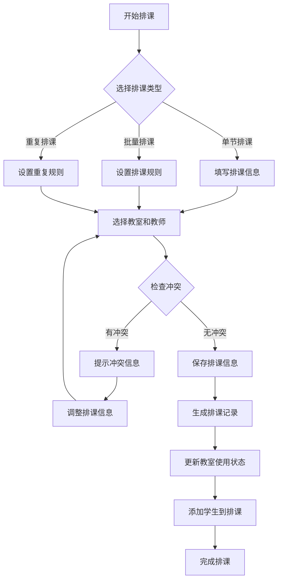
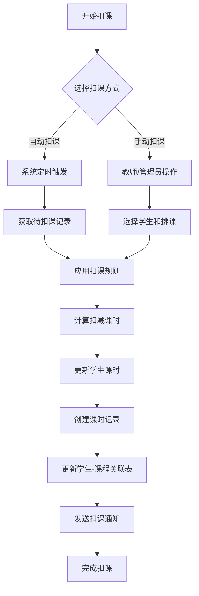
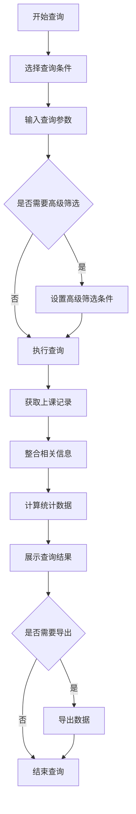
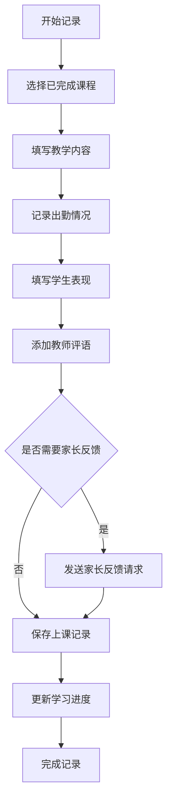

# 课程管理系统功能设计-排课、扣课、上课历史与上课记录

## 1. 功能概述

本文档详细描述课程管理系统中排课、扣课、上课历史查询以及上课记录/档案管理功能的设计实现，确保系统能够满足教育机构的日常教学管理需求。

## 2. 排课功能设计

### 2.1 功能说明
排课功能允许管理员和教师根据课程需求、教师资源和教室资源进行课程安排，支持单节排课、批量排课和重复排课等多种方式。

### 2.2 核心流程

### 2.3 业务规则

1. **排课基本规则**：
   - 同一时间段内，一个教师只能在一个教室授课
   - 同一时间段内，一个教室只能安排一个课程
   - 排课时间不能与教师或教室的已排课程冲突
   - 排课开始时间必须早于结束时间

2. **排课类型**：
   - 常规课：按照固定周期安排的课程
   - 补课：因特殊情况需要补充的课程
   - 试听：学生体验课程

3. **学生添加规则**：
   - 学生必须已报名相关课程
   - 学生课时余额必须足够
   - 可针对单个排课添加/移除学生

### 2.4 数据库操作

1. **创建排课**：向 `schedule` 表插入记录
2. **添加学生到排课**：向 `schedule_student` 表插入记录
3. **更新教室使用状态**：向 `classroom_status_log` 表插入记录
4. **冲突检测**：查询 `schedule` 和 `classroom_status_log` 表检查冲突

### 2.5 用户界面设计

1. **排课日历视图**：直观显示教师和教室的排课情况
2. **排课表单**：包含课程、教师、教室、时间等信息
3. **冲突提示**：清晰展示冲突信息和冲突原因
4. **排课列表**：支持按条件筛选和批量操作

## 3. 扣课功能设计

### 3.1 功能说明
扣课功能负责管理学生课时的扣除，支持自动扣课和手动扣课两种方式，确保课时管理的准确性和灵活性。

### 3.2 核心流程

### 3.3 业务规则

1. **自动扣课规则**：
   - 根据排课表和签到记录自动计算扣减课时
   - 支持基于出勤状态的差异化扣减（出勤、迟到、缺勤等）
   - 可配置扣课触发时间和频率

2. **手动扣课规则**：
   - 支持教师或管理员手动录入扣课记录
   - 需填写扣课原因和相关说明
   - 手动扣课需经过审批流程

3. **扣减逻辑**：
   - 扣减课时不能超过学生剩余课时
   - 支持按比例扣减（如迟到只扣50%课时）
   - 可设置最小/最大扣减课时

### 3.4 数据库操作

1. **创建扣课记录**：向 `course_hours_record` 表插入记录（record_type='deduction'）
2. **更新学生课时**：更新 `student_course` 表的 `remaining_hours` 和 `used_hours` 字段
3. **应用扣课规则**：查询 `deduction_rule` 表获取适用规则
4. **记录学生档案**：更新 `student_class_archive` 表的 `hours_deducted` 字段

### 3.5 异常处理

1. **课时不足**：当学生课时不足时，系统提示并可选择暂停该学生的课程
2. **扣课失败**：记录失败日志，支持手动重试
3. **规则冲突**：当多条扣课规则同时适用时，按优先级处理

## 4. 上课历史查询功能设计

### 4.1 功能说明
上课历史查询功能允许管理员、教师、学生和家长查看学生的历史上课记录，包括出勤情况、学习表现等信息。

### 4.2 核心流程

### 4.3 业务规则

1. **查询权限控制**：
   - 学生/家长：只能查询自己/子女的上课记录
   - 教师：只能查询自己授课的班级学生记录
   - 管理员：可以查询所有学生记录

2. **查询条件**：
   - 时间范围（日、周、月、学期）
   - 课程筛选
   - 教师筛选
   - 出勤状态筛选

3. **统计分析**：
   - 出勤率计算
   - 课时使用情况
   - 平均上课时长

### 4.4 数据库操作

1. **查询上课记录**：查询 `student_class_archive` 和 `class_record` 表
2. **关联信息整合**：关联查询 `schedule`、`teacher`、`classroom` 等表
3. **统计数据计算**：使用聚合函数计算统计指标

### 4.5 用户界面设计

1. **日历视图**：以日历形式展示学生的上课安排
2. **列表视图**：详细展示每次课程的信息
3. **统计图表**：直观展示出勤率和课时使用情况
4. **导出功能**：支持Excel、PDF等格式导出

## 5. 上课记录/档案管理功能设计

### 5.1 功能说明
上课记录/档案管理功能允许教师记录每次课程的详细情况，包括教学内容、学生表现、考勤情况等，并形成完整的学生学习档案。

### 5.2 核心流程

### 5.3 业务规则

1. **记录权限控制**：
   - 只有当节课程的授课教师可以记录
   - 管理员可以查看和修改所有记录

2. **记录内容要求**：
   - 教学内容必须填写
   - 出勤情况必须完整记录
   - 可选择性添加学生表现和评语

3. **档案完整性**：
   - 每次课程必须形成完整档案
   - 档案内容不可随意删除，只可修改
   - 支持版本管理和修改记录

### 5.4 数据库操作

1. **创建上课记录**：向 `class_record` 表插入记录
2. **更新学生档案**：向 `student_class_archive` 表插入或更新记录
3. **记录出勤情况**：更新 `attendance` 表的相关记录
4. **更新学习进度**：更新 `learning_progress` 表的相关字段

### 5.5 用户界面设计

1. **上课记录表单**：结构化的表单，包含所有需要记录的字段
2. **学生列表**：显示课程中的学生，方便记录每位学生的表现
3. **富文本编辑器**：支持教学内容和评语的格式化编辑
4. **附件上传**：支持上传教学资料和学生作品

## 6. 集成与交互

### 6.1 功能间集成

1. **排课与签到集成**：
   - 排课完成后，系统自动创建签到任务
   - 签到结果影响课时扣除和出勤统计

2. **扣课与财务集成**：
   - 课时不足时，系统提醒续费
   - 生成课时使用报表，用于财务核算

3. **上课记录与学习进度集成**：
   - 根据上课记录自动更新学习进度
   - 基于学习表现生成学习建议

### 6.2 外部系统集成

1. **与消息系统集成**：
   - 发送课程提醒、签到通知、扣课通知等
   - 支持短信、微信等多种通知渠道

2. **与家长端集成**：
   - 提供家长查看学生上课记录的接口
   - 支持家长反馈和评价功能

## 7. 性能优化

### 7.1 数据查询优化

1. **索引优化**：合理设计索引，提高查询效率
2. **查询优化**：优化SQL语句，减少查询时间
3. **缓存策略**：对常用数据进行缓存，减轻数据库压力

### 7.2 批处理优化

1. **批量操作**：支持批量排课、批量扣课等操作
2. **异步处理**：使用异步方式处理耗时操作，提高系统响应速度
3. **定时任务优化**：合理设置定时任务，避免系统高峰期执行

## 8. 安全措施

### 8.1 数据安全

1. **数据加密**：敏感数据加密存储
2. **访问控制**：严格的权限管理，确保数据访问安全
3. **数据备份**：定期备份数据，防止数据丢失

### 8.2 操作安全

1. **操作日志**：记录所有关键操作，便于审计
2. **防误操作**：关键操作需二次确认
3. **异常监控**：监控异常操作，及时发现安全问题

## 9. 后续扩展

### 9.1 智能排课
- 基于历史数据和资源情况，实现智能排课建议
- 支持自动避开教师和教室的冲突时间

### 9.2 智能扣课
- 基于学生出勤模式和学习表现，优化扣课策略
- 支持个性化扣课规则设置

### 9.3 数据分析
- 深入分析学生学习情况，提供学习建议
- 生成教学质量报告，辅助教学决策

---

通过以上设计，系统能够全面支持教育机构的排课、扣课、上课历史查询以及上课记录/档案管理需求，提高教学管理效率，保障教学质量。